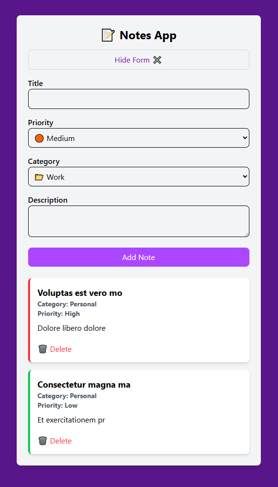

# 📝 Notes App

A modern, responsive note-taking application built with React and styled with Tailwind CSS. This app helps you organize your thoughts, tasks, and ideas with an intuitive interface and priority-based categorization system.



## ✨ Features

### Core Functionality
- **Create Notes**: Add new notes with title, description, category, and priority level
- **Delete Notes**: Remove notes with confirmation dialog to prevent accidental deletion
- **Collapsible Form**: Toggle the note creation form to save screen space
- **Real-time Updates**: Instant addition and removal of notes without page refresh

### Organization System
- **Priority Levels**: 
  - 🔴 High Priority (Red border)
  - 🟠 Medium Priority (Orange border) 
  - 🟢 Low Priority (Green border)

- **Categories**:
  - 📂 Work - Professional tasks and projects
  - 🏠 Personal - Personal reminders and notes
  - 💡 Ideas - Creative thoughts and brainstorming

### User Experience
- **Responsive Design**: Works seamlessly on desktop and mobile devices
- **Visual Feedback**: Color-coded priority system with intuitive border styling
- **Clean Interface**: Minimalist design focused on content and usability
- **Form Validation**: Ensures required fields are filled before submission
- **Smooth Interactions**: Hover effects and transitions for better user experience

## 🛠️ Technology Stack

- **Frontend Framework**: React 19.1.0 with hooks (useState)
- **Build Tool**: Vite 7.0.4 for fast development and optimized builds
- **Styling**: Tailwind CSS 4.1.11 for utility-first styling
- **Code Quality**: ESLint with React-specific rules and hooks validation
- **Development**: Hot Module Replacement (HMR) for instant updates

## 📁 Project Structure

```
src/
├── components/
│   ├── NoteForm.jsx          # Form component for creating notes
│   ├── NoteList.jsx          # Component for displaying notes list
│   └── inputs/
│       ├── TextInput.jsx     # Reusable text input component
│       ├── TextAreaInput.jsx # Reusable textarea component
│       └── SelectInput.jsx   # Reusable select dropdown component
├── App.jsx                   # Main application component
├── main.jsx                  # Application entry point
└── index.css                 # Global styles and Tailwind imports
```

## 🎨 Design Highlights

- **Purple Color Scheme**: Professional purple gradient background with clean white note cards
- **Priority Visual System**: Left border color coding for instant priority recognition
- **Card-based Layout**: Each note is presented in a clean, shadowed card design
- **Responsive Typography**: Proper heading hierarchy and readable font sizes
- **Interactive Elements**: Hover states and smooth transitions throughout the interface

## 🚀 Key Components

### NoteForm
Handles note creation with a collapsible interface featuring:
- Dynamic form visibility toggle
- Input validation for required fields
- Controlled components for all form inputs
- Default values for priority and category

### NoteList
Manages note display and interactions:
- Conditional rendering for empty states
- Dynamic styling based on note properties
- Delete functionality with confirmation
- Responsive grid layout

### Input Components
Reusable form elements that maintain consistency:
- Standardized styling across all inputs
- Proper labeling and accessibility
- Flexible prop-based configuration

## 💡 Usage Patterns

1. **Quick Note Creation**: Click "Add New Note ➕" to reveal the form
2. **Categorized Organization**: Select appropriate category and priority level
3. **Visual Scanning**: Use color-coded borders to quickly identify note importance
4. **Safe Deletion**: Confirmation dialog prevents accidental note removal
5. **Clean Workspace**: Collapse form when not needed to focus on existing notes

This Notes App demonstrates modern React development practices with a focus on user experience, code organization, and responsive design principles.